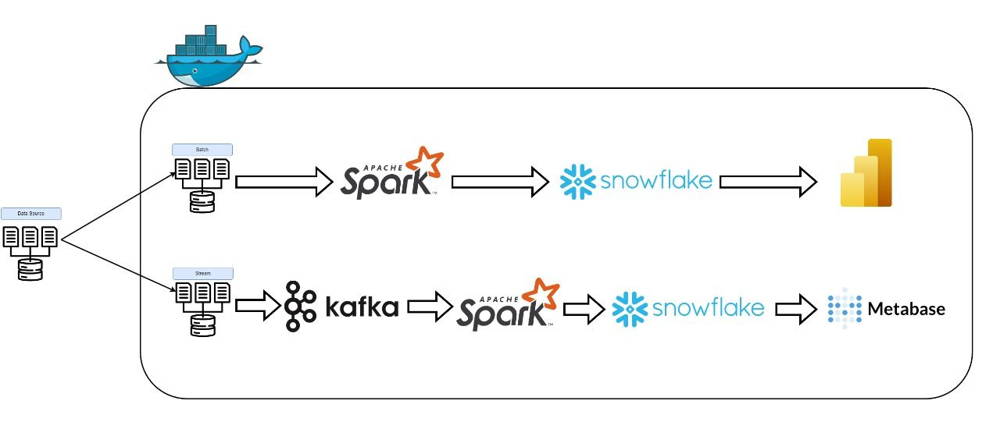

<h1 align="center">📊 Loans & Credits End-to-End Data Engineering Pipeline</h1>

<p align="center">
  
</p>

---

## 🔍 Overview

This project demonstrates a complete data engineering pipeline that processes loan and credit data using both **batch** and **streaming** ingestion methods. It transforms and models the data into a star schema and loads it into **Snowflake** for downstream analytics and visualization.

---

## 🧱 Architecture Breakdown

- **Batch Processing**: Historical data ingestion using Apache Spark from CSV files.
- **Streaming**: Row-by-row real-time data simulation into Kafka and ingestion using Spark Structured Streaming.
- **Data Modeling**: Dimensional star schema built with fact and dimension tables.
- **Data Warehouse**: Cleaned data is stored in Snowflake.
- **Dashboarding**: BI tools used to generate insights from the modeled data.

---

## 🛠️ Tools & Technologies

| Tool        | Purpose                          |
|-------------|----------------------------------|
| Apache Kafka | Real-time data ingestion         |
| Apache Spark | Batch + Streaming transformation |
| Snowflake    | Scalable cloud data warehouse    |
| Python & PySpark | Scripting & transformation |
| Power BI / Tableau | Data visualization        |

---

## 🗂️ Repository Structure

```
├── Batch/               # Batch ingestion & transformation code
├── Streaming/           # Kafka + Spark Streaming scripts
├── Data Model/          # Data modeling diagrams
├── Insights/            # Dashboards and visuals
├── Tools settings/      # Configuration files
└── Data-pipeline.png    # Pipeline architecture
```

---

## 🔁 Pipeline Overview

<p align="center">
  
</p>

---

## 📊 Dashboard Insights

Visualizations were developed using BI tools to explore metrics such as loan volume, borrower profiles, and hardship trends.

<p float="left" align="center">
  
  
</p>

---

## 🧩 Dimensional Data Model

A star schema is used to model the cleaned data for analytics.

<p align="center">
  
</p>

---

## 🚀 Getting Started

### 1. Clone the Repository

```bash
git clone https://github.com/HaiidyHossam/Loans-Credits-end-to-end-data-engineering-solution.git
cd Loans-Credits-end-to-end-data-engineering-solution
```

### 2. Set Up Environment

Make sure you have the following installed:

- Java 11+
- Apache Spark 3.4+
- Kafka (Docker or local)
- Snowflake Account
- Power BI or Tableau

### 3. Run Batch Jobs

Navigate to `/Batch` and run the PySpark scripts for batch ingestion.

### 4. Run Streaming Jobs

Simulate real-time ingestion by pushing rows to Kafka and consuming with Spark from `/Streaming`.

### 5. Explore Dashboards

Open dashboard files from the `/Insights` folder.

---

## 📦 Dataset Source

The dataset used in this project is publicly available on Kaggle:

🔗 [Loan Credit Risk and Population Stability – Kaggle](https://www.kaggle.com/datasets/beatafaron/loan-credit-risk-and-population-stability)

---

## 👩‍💻 Author

**Haiidy Hossam**  
💼 Data Engineering Enthusiast  
📧 [haiidy.hossam@example.com](mailto:haiidy.hossam@example.com)

---

## 📝 License

This project is intended for learning and demonstration purposes only.
