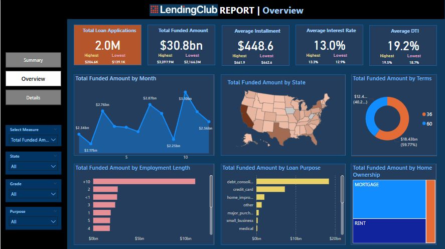
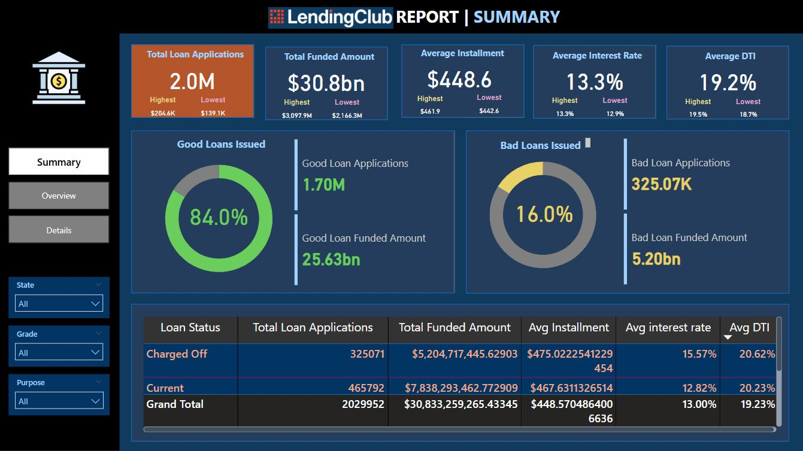

# Lending Club Data Engineering Project

## Overview

This project is a complete data engineering pipeline built on **Lending Club** data — a peer-to-peer lending platform that connects borrowers with investors. The project leverages both **batch** and **stream** data pipelines to ingest, process, transform, and load loan application data into a Snowflake data warehouse for analytics and monitoring.

The goal is to build scalable and efficient pipelines using modern data engineering tools and best practices, simulating a real-world banking data workflow.

📚 You can read more about Lending Club [here](https://en.wikipedia.org/wiki/Lending_Club).  
📊 Dataset: [Kaggle - Loan Credit Risk and Population Stability](https://www.kaggle.com/datasets/beatafaron/loan-credit-risk-and-population-stability)

---

## Project Architecture

- **Batch Pipeline**: Built using PySpark for transformation, integrated with Snowflake for data warehousing.
- **Streaming Pipeline**: Simulated real-time data using Kafka, processed with PySpark Structured Streaming, and loaded into a separate streaming schema in Snowflake.
- **Deployment**: Entire stack containerized using Docker and Docker Compose.

📸 Pipeline 
<p align="center">
  
</p>

## Pipeline Breakdown

### 1. Data Exploration

- Understand the business and data context of Lending Club's loan and risk profiles.
- Explore two CSV datasets provided from Kaggle to assess credit risk and population stability.
- Perform initial data cleaning and schema identification.

### 2. Batch Pipeline

- **Data Source**: Two CSV files from Kaggle.
- **ETL Process**:
  - Extract data using PySpark.
  - Transform using business logic (null handling, standardization, encoding).
  - Load the data into Snowflake data warehouse using the **Snowflake Connector for Spark**.
- **Schema**: Snowflake schema design.

  📸 Schema
<p align="center">
  
</p>

### 3. Streaming Pipeline

- **Simulation**: A custom script was used to stream data in near real-time from a CSV file.
- **Ingestion**: Kafka topics used to publish and consume records.
- **Processing**: PySpark Structured Streaming processes the data stream.
- **Storage**: Cleaned streaming data is loaded into Snowflake under a separate **streaming schema**.
- **Schema**: Also based on Snowflake schema but adapted for streaming behavior.

---

## Tech Stack

| Component        | Technology               |
|------------------|--------------------------|
| Data Warehouse   | Snowflake                |
| Data Processing  | PySpark                  |
| Streaming        | Apache Kafka             |
| Containerization | Docker & Docker Compose  |
| Data Source      | Kaggle CSV Files         |

---

📸 Dashboard  
<p align="center">
  
</p>
<p align="center">
  
</p>
## Project Structure

lending-club-project/ │ ├── docker/ # Docker Compose setup ├── kafka/ # Kafka setup and simulation script ├── pyspark_jobs/ # PySpark ETL and streaming scripts ├── data/ # Input CSVs ├── snowflake_models/ # SQL models and schema design └── README.md # Project documentation

---

## Getting Started

### Prerequisites

- Docker & Docker Compose installed
- Snowflake account with credentials
- Access to Kaggle dataset

### Run the Project

1. Clone the repository
2. Add your Snowflake credentials to `.env`
3. Place the Kaggle CSVs in the `data/` directory
4. Run the following:

```bash
docker-compose up --build
